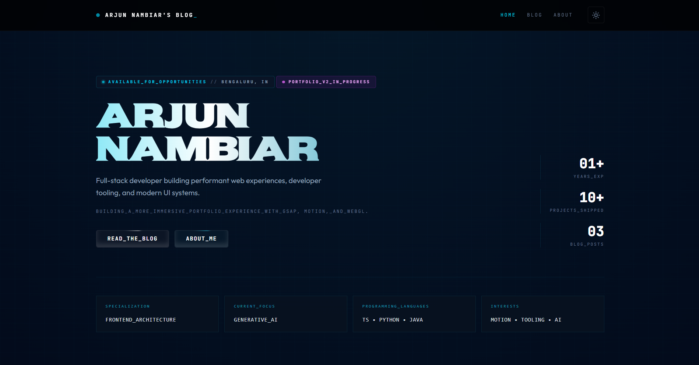
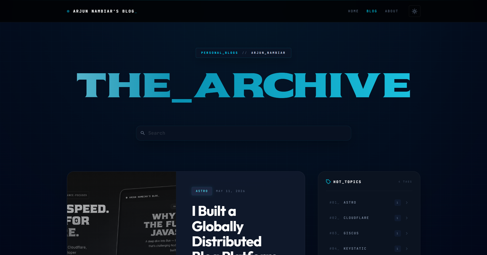
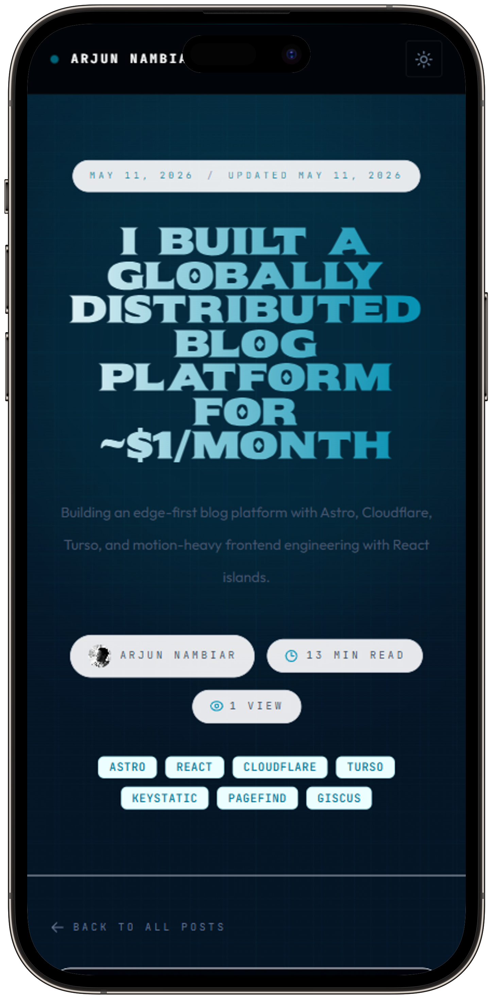
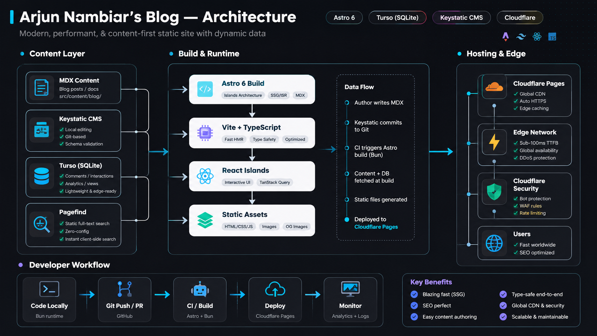

# Arjun Nambiar's Blog

A content-first blog platform built with Astro, Cloudflare, and Turso.

Instead of using Medium or Substack, I wanted to build a blog that felt engineered from the ground up:
- static-first rendering
- edge delivery
- interactive islands only where needed
- custom engagement systems
- motion-heavy UI
- globally fast performance

The site is deployed on Cloudflare’s edge network and powered by Astro Islands Architecture, Turso, Keystatic CMS, and React islands.

---

## Screenshots

### Homepage



---

### Blog Page



---

### Mobile View



---

### Lighthouse Score


---

### Architecture Diagram



---

## Why I Built This

Most personal blogs today are either:
- generic static sites
- slow client-heavy React apps
- or hosted platforms with limited customization

I wanted something that:
- ships minimal JavaScript
- feels visually unique
- supports advanced frontend interactions
- scales globally
- remains extremely cheap to operate
- gives full ownership over content and infrastructure

This project became a playground for:
- frontend engineering
- motion systems
- edge architecture
- performance optimization
- content platform experimentation

---

## Architecture

```txt
User
  ↓
Cloudflare Edge Network
  ↓
Astro Static Pages + React Islands
  ↓
Cloudflare Workers APIs
  ↓
Turso Edge Database
```

### Core Architecture Decisions

#### Astro Islands Architecture
Pages ship static HTML by default.

Interactive features like:
- comments
- likes
- search
- TOC tracking
- theme toggles

are hydrated independently as React islands.

This keeps performance high while still supporting rich UI interactions.

---

#### Cloudflare Edge Deployment

The platform is deployed on Cloudflare Pages + Workers for:
- global edge caching
- low latency
- observability
- automatic deployments
- DDoS protection

---

#### Turso (Edge SQLite)

Turso is used for:
- analytics
- page views
- likes
- lightweight interaction systems

Using distributed SQLite for a content platform felt more appropriate than running a centralized database.

---

## Features

### Content System
- MDX blog posts
- Git-based content workflow
- Keystatic CMS integration
- Dynamic OG image generation
- RSS feed
- Sitemap generation

### Frontend Experience
- Motion-heavy UI
- Animated bento blog grid
- Reading progress tracking
- Table of contents tracking
- Dark/light theme support
- Responsive layout system
- Dual-theme syntax highlighting

### Search & Engagement
- Static full-text search via Pagefind
- Giscus-powered comments
- Per-post likes
- Share dropdown
- Scroll restoration
- Back-to-top interactions

### Performance
- Static-first rendering
- Partial hydration
- Edge delivery
- Minimal client-side JS
- Optimized image handling
- Lighthouse-focused optimizations

---

## Tech Stack

| Category | Technology |
|---|---|
| Framework | Astro 6 |
| Frontend | React 19 |
| Styling | Tailwind CSS 4 |
| Motion | Framer Motion + custom effects |
| CMS | Keystatic |
| Database | Turso |
| ORM | Drizzle ORM |
| Deployment | Cloudflare Pages |
| APIs | Cloudflare Workers |
| Search | Pagefind |
| Comments | Giscus |
| Runtime | Bun |
| Syntax Highlighting | Shiki |
| OG Images | Satori |

---

## Local Development

### Prerequisites

- Bun 1.0+
- Node.js 22+ (optional)

### Install

```bash
bun install
```

### Start Development Server

```bash
bun run dev
```

### Production Build

```bash
bun run build
```

### Preview Production Build

```bash
bun run preview
```

---

## Environment Variables

Create a `.env` file:

```env
TURSO_DATABASE_URL=
TURSO_AUTH_TOKEN=

PUBLIC_GISCUS_REPO=
PUBLIC_GISCUS_REPO_ID=
PUBLIC_GISCUS_CATEGORY=
PUBLIC_GISCUS_CATEGORY_ID=
```

---

## Project Structure

```txt
src/
├── components/
│   ├── islands/
│   ├── ui/
│   └── animations/
├── content/blog/
├── layouts/
├── pages/
├── lib/
├── styles/
└── workers/
```

---

## Interesting Systems

Some implementation details I particularly enjoyed building:

- animated bento-grid blog cards
- spotlight hover systems
- particle-based UI effects
- dynamic OG image generation
- page view tracking
- edge interaction APIs
- custom search experience
- motion-heavy hero sections
- progressive enhancement patterns

---

## Performance

The site is optimized heavily around:
- static rendering
- minimal hydration
- edge caching
- lightweight client runtime

Lighthouse scores consistently target:
- 90+ Performance
- 100 SEO

---

## License

MIT